# URLPriceCheck — Architecture & Code Documentation

Native **macOS + iOS** app that watches product URLs, extracts prices from store pages, and sends local notifications when targets are hit. This document describes how the codebase is organized, how data flows, and how price detection is routed per retailer.

For setup and day-to-day use, see [README.md](README.md).

---

## Table of contents

1. [System overview](#system-overview)
2. [Project structure](#project-structure)
3. [Targets & platform split](#targets--platform-split)
4. [Application layers](#application-layers)
5. [Data model](#data-model)
6. [Price check pipeline](#price-check-pipeline)
7. [Price resolution routing](#price-resolution-routing)
8. [UI architecture](#ui-architecture)
9. [Shared URL intake](#shared-url-intake)
10. [Notifications](#notifications)
11. [Background scheduling](#background-scheduling)
12. [On-device AI (Apple Intelligence)](#on-device-ai-apple-intelligence)
13. [Python companion script](#python-companion-script)
14. [Key types & files reference](#key-types--files-reference)
15. [Design decisions](#design-decisions)

---

## System overview

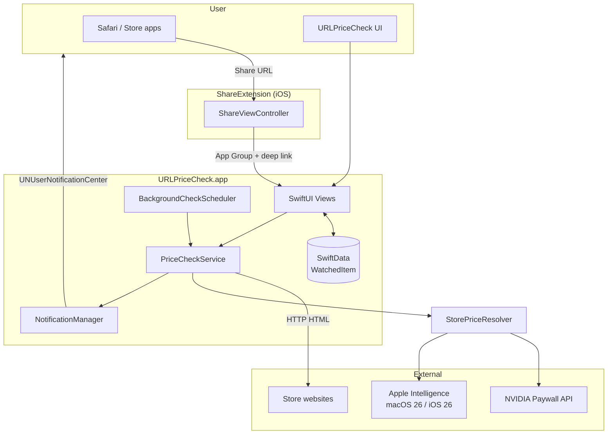

| Concern | Technology |
|--------|------------|
| UI | SwiftUI |
| Persistence | SwiftData (`WatchedItem`) |
| Networking | `URLSession` (+ macOS `curl` fallback) |
| Notifications | `UserNotifications` |
| iOS background | `BackgroundTasks` (`BGAppRefreshTask`) |
| iOS share | Share Extension + App Group |
| AI (optional) | `FoundationModels` when OS ≥ 26 |

---

## Project structure

```
URLPriceCheck/
├── URLPriceCheck.xcodeproj
├── README.md
├── ARCHITECTURE.md          ← this file
├── ShareExtension/          ← iOS only
│   ├── ShareViewController.swift
│   ├── Info.plist
│   └── ShareExtension.entitlements
└── URLPriceCheck/
    ├── URLPriceCheckApp.swift      # @main, delegates, SharedURLStore
    ├── Info.plist                  # URL scheme, BG task ID
    ├── URLPriceCheck.entitlements  # App Group
    ├── Models/
    │   └── WatchedItem.swift
    ├── Views/
    │   ├── ContentView.swift
    │   ├── AddWatchView.swift
    │   ├── WatchFormView.swift
    │   ├── WatchDetailView.swift
    │   ├── WatchRowView.swift
    │   └── FormLTRRow.swift
    ├── Services/
    │   ├── PriceCheckService.swift       # Orchestrates fetch → price → notify
    │   ├── StorePriceResolver.swift      # Retailer routing
    │   ├── PageFetcher.swift
    │   ├── PriceExtractor.swift          # JSON-LD, meta, regex
    │   ├── StoreHTMLPriceExtractor.swift # Amazon, NVIDIA HTML
    │   ├── SmartPriceFinder.swift
    │   ├── OnDeviceAIPriceExtractor.swift # AI + ProductNameResolver
    │   ├── GeForceNOWPaywallPriceFetcher.swift
    │   ├── GeForceAnnualPriceExtractor.swift
    │   ├── HintAnchoredPriceExtractor.swift
    │   ├── CustomKeywordHints.swift
    │   ├── StoreKeywordProfile.swift
    │   ├── NotificationManager.swift
    │   ├── BackgroundCheckScheduler.swift
    │   ├── DetectedPrice.swift
    │   └── HTMLTextStripper.swift
    └── Assets.xcassets/
```

---

## Targets & platform split

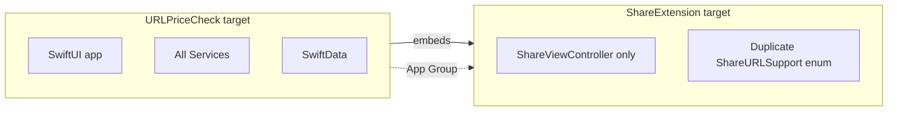

| Target | Bundle ID | Role |
|--------|-----------|------|
| **URLPriceCheck** | `com.deanwass.URLPriceCheck` | Full app (macOS + iOS) |
| **ShareExtension** | `com.deanwass.URLPriceCheck.ShareExtension` | iOS share sheet only |

**App Group:** `group.com.deanwass.URLPriceCheck` — passes pending URLs from the extension to the main app.

**URL scheme:** `urlpricecheck://add?url=<encoded-https-url>`

| Feature | macOS | iOS |
|---------|-------|-----|
| Share extension | — | ✓ |
| `curl` SSL fallback | ✓ | — |
| `BGAppRefreshTask` | — | ✓ |
| Foreground 15 min timer | ✓ | ✓ |
| Pasteboard “Paste URL” | ✓ | ✓ |

---

## Application layers

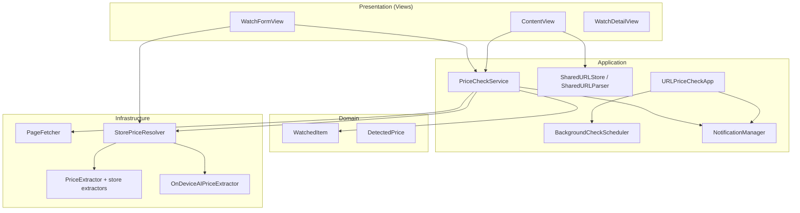

All UI and services that touch `WatchedItem` run on **`@MainActor`** where needed; network fetch and AI run in `async` contexts.

---

## Data model

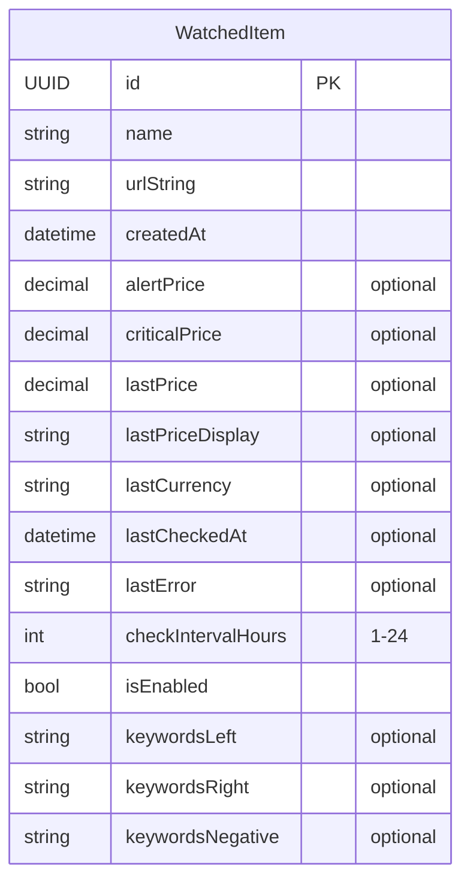

### `WatchedItem` (SwiftData `@Model`)

| Field | Purpose |
|-------|---------|
| `name` | Display label; auto-filled from page when empty |
| `urlString` | Product page URL |
| `alertPrice` / `criticalPrice` | Notify when `lastPrice ≤ threshold` |
| `checkIntervalHours` | Minimum hours between automatic checks |
| `keywordsLeft` / `keywordsRight` / `keywordsNegative` | Comma-separated hints for `HintAnchoredPriceExtractor` |
| `lastPrice`, `lastPriceDisplay`, `lastCheckedAt`, `lastError` | Last run state |

**Computed:**

- `url` — parsed `URL` from `urlString`
- `isDueForCheck` — enabled and interval elapsed since `lastCheckedAt`

---

## Price check pipeline

End-to-end flow for a single watch (manual “Check”, “Check all”, or background):

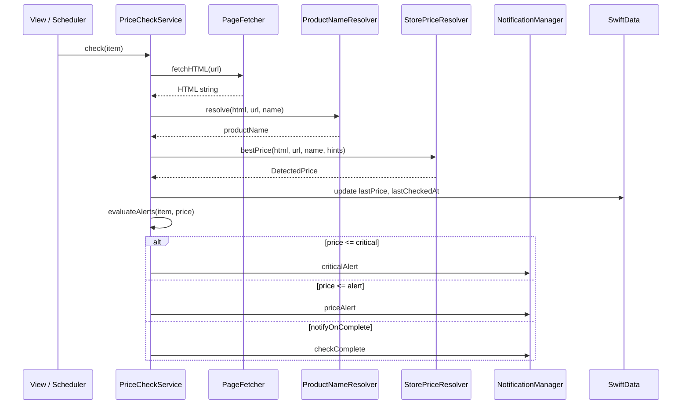

### `PriceCheckService.check(item:notifyOnComplete:)`

1. Validate URL → error notification if invalid.
2. **Fetch** HTML via `PageFetcher`.
3. **Resolve product name** via `ProductNameResolver` (JSON-LD → meta/h1 → on-device AI → URL slug); persist if `name` was empty.
4. **Extract price** via `StorePriceResolver.bestPrice`.
5. Write `lastPrice`, `lastPriceDisplay`, `lastCurrency`, `lastCheckedAt`, clear `lastError`.
6. **`evaluateAlerts`** — critical beats alert beats generic “check complete”.

---

## Price resolution routing

`StorePriceResolver` is the single entry point. It picks strategies based on **host** and page shape, not a single global algorithm.

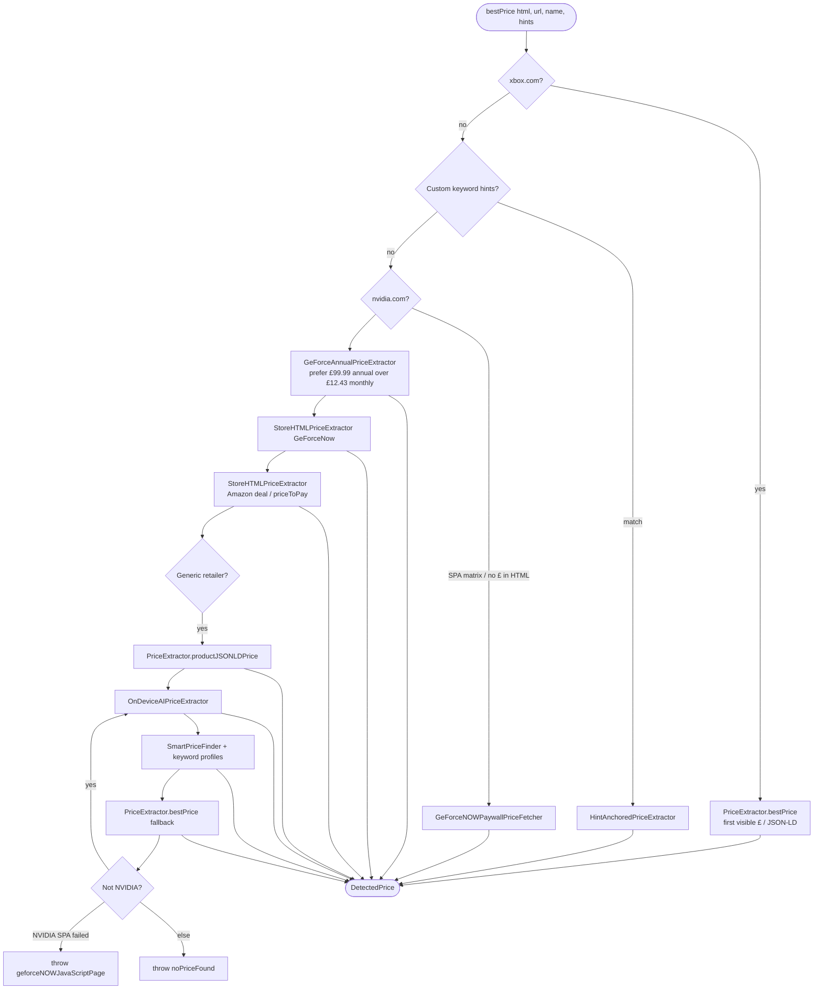

### Retailer summary

| Store type | Primary strategy | Notes |
|------------|------------------|-------|
| **Xbox** | `PriceExtractor.bestPrice` | Matches Python: first `£X.XX` in document order |
| **Amazon** | `StoreHTMLPriceExtractor` | Prefers `priceToPay`; penalizes “Was” / strikethrough |
| **NVIDIA / GeForce NOW** | Paywall API → annual extractor → HTML | **No AI** on empty JS pages (avoids hallucinated £12.43) |
| **Generic** (Cult Beauty, etc.) | JSON-LD → AI → `SmartPriceFinder` | AI only when OS supports Foundation Models |
| **Any** + user hints | `HintAnchoredPriceExtractor` | Scores prices near keyword anchors |

### `DetectedPrice`

```swift
struct DetectedPrice {
    let amount: Decimal      // numeric compare for alerts
    let currency: String     // GBP, USD, EUR
    let display: String      // e.g. "£49.74"
    let source: String       // provenance: jsonld, display, ai, etc.
}
```

---

## UI architecture

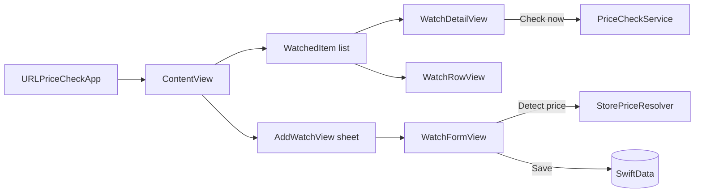

| View | Responsibility |
|------|----------------|
| **ContentView** | List, “Check all”, add sheet, notification banner, `onOpenURL` / pending shared URL |
| **AddWatchView** | Wrapper sheet; passes `initialURL` to form |
| **WatchFormView** | Create/edit: URL, name, alert/critical, interval, keyword hints, detect price |
| **WatchDetailView** | Single item history actions, manual check |
| **WatchRowView** | Row summary: name, price, last check, error badge |

Navigation uses `NavigationStack` + `NavigationLink`; edit via sheet (`itemToEdit`).

---

## Shared URL intake

Three paths into the add-watch flow with a pre-filled URL:

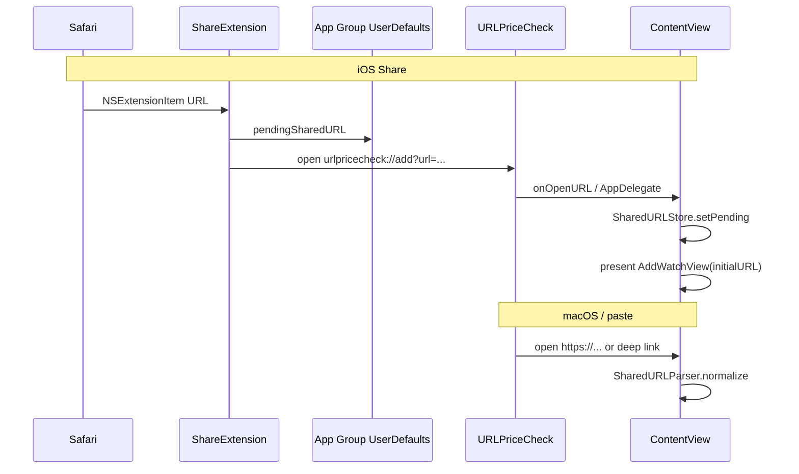

**`SharedURLStore`** and **`SharedURLParser`** live in `URLPriceCheckApp.swift` (merged into the app target for reliable compilation with iCloud-synced projects).

The Share Extension duplicates a minimal `ShareURLSupport` enum — extensions cannot import the main app module.

---

## Notifications

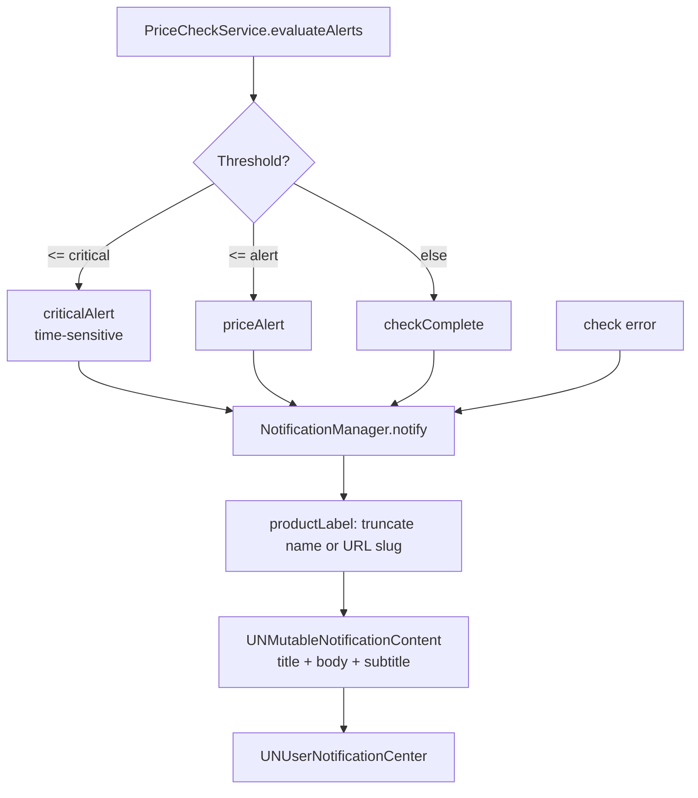

### Notification content

| Kind | Title example | Body |
|------|---------------|------|
| Check complete | `Halo Wars 2 — checked` | `Halo Wars 2: Current price: £49.74` |
| Price alert | `Price alert · Cult Beauty…` | `{label}: Current price: … — at or below your alert …` |
| Critical | `CRITICAL · …` | Same pattern, time-sensitive interruption (iOS 15+) |
| Error | `Check failed · …` | `{label} — {error}` |

`productLabel` uses up to **42 characters** of `item.name`, or falls back to URL path slug / hostname.

`NotificationCenterDelegate` shows banners **while the app is in the foreground**.

---

## Background scheduling

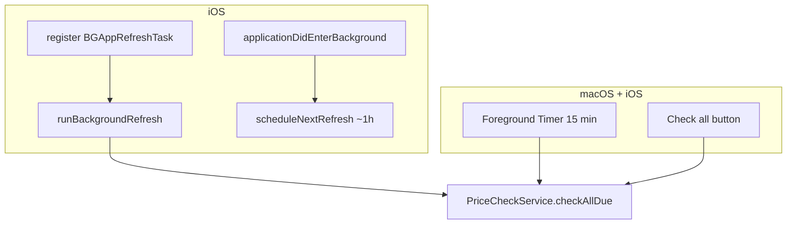

| Mechanism | Interval | When it runs |
|-----------|----------|--------------|
| Foreground `Timer` | 15 minutes | App open (both platforms) |
| `BGAppRefreshTask` | ~1 hour earliest | iOS, system decides |
| User **Check all** | On demand | Any time |

**Task ID:** `com.deanwass.URLPriceCheck.refresh` (must match `Info.plist` `BGTaskSchedulerPermittedIdentifiers`).

For **hourly checks while macOS app is quit**, the original Python script + LaunchAgent remains an option (see [Python companion script](#python-companion-script)).

---

## On-device AI (Apple Intelligence)

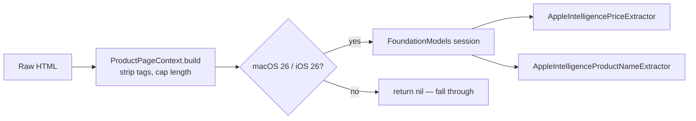

- Gated with `#available(macOS 26.0, iOS 26.0, *)` and `#if canImport(FoundationModels)`.
- **`ProductNameResolver`** (in `OnDeviceAIPriceExtractor.swift`): JSON-LD name → Open Graph / `<h1>` → AI → URL slug.
- AI is **skipped for NVIDIA** when the page is a JS-only product matrix without prices in HTML.

---

## Python companion script

`URLPricecheck.py` (repo root) is the original checker:

- Fetches with `urllib` + **curl fallback** on SSL failure (same idea as macOS `PageFetcher`).
- Price: `re.findall(r'£\d+\.\d{2}', html)[0]` — first pound price in the page.

The Swift app **generalizes** this for multiple stores, currencies, and alerts. You can run both: the app for interactive use and notifications; Python/LaunchAgent for headless macOS schedules.

---

## Key types & files reference

| File | Type / symbol | Role |
|------|----------------|------|
| `URLPriceCheckApp.swift` | `URLPriceCheckApp`, `AppDelegate`, `MacAppDelegate`, `SharedURLStore` | App entry, URL handling |
| `WatchedItem.swift` | `@Model WatchedItem` | Persistence |
| `PriceCheckService.swift` | `PriceCheckService` | Check orchestration |
| `StorePriceResolver.swift` | `enum StorePriceResolver` | Retailer routing |
| `PageFetcher.swift` | `enum PageFetcher` | HTTP + macOS curl |
| `PriceExtractor.swift` | `enum PriceExtractor` | JSON-LD, meta, regex |
| `StoreHTMLPriceExtractor.swift` | Amazon / NVIDIA HTML rules | |
| `SmartPriceFinder.swift` | Scored candidate prices | Keyword profiles |
| `OnDeviceAIPriceExtractor.swift` | AI extractors, `ProductNameResolver` | |
| `GeForceNOWPaywallPriceFetcher.swift` | NVIDIA API client | |
| `NotificationManager.swift` | `NotificationManager`, `AlertKind` | Local notifications |
| `BackgroundCheckScheduler.swift` | BG task + foreground timer | |
| `ShareViewController.swift` | iOS share extension | |

---

## Design decisions

1. **Router pattern for prices** — One `StorePriceResolver` avoids scattering `if amazon` across views; new stores add extractors without UI changes.

2. **Xbox = Python parity** — First visible `£` price, not `min()` over all matches, so “recommended” tiles do not win.

3. **NVIDIA API before AI** — JS-rendered GeForce NOW pages have no reliable HTML prices; the paywall API matches the website; AI on empty HTML was removed after wrong example prices.

4. **SharedURLStore in app entry file** — Separate `SharedURLStore.swift` was not always compiled when the project lives on iCloud Drive; merging into `URLPriceCheckApp.swift` keeps the target consistent.

5. **Share extension isolation** — Duplicate URL helpers in the extension; no shared Swift module between targets.

6. **MainActor services** — UI-bound state (`WatchedItem` updates, notifications) stays on the main actor; fetches are `async`.

7. **Notifications always name the product** — Truncated label in title and body so lock-screen alerts are identifiable.

---

## Related documentation

- [README.md](README.md) — install, signing, background refresh, example watch
- [Source repository (GitHub)](https://github.com/MonkeyMan101/URLPriceCheck)
- Apple: [Background Tasks](https://developer.apple.com/documentation/backgroundtasks), [Share extensions](https://developer.apple.com/documentation/uikit/share_extensions)
